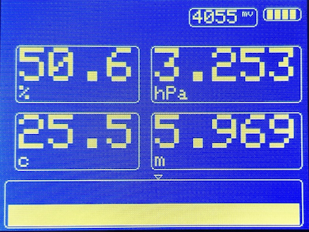

# Tgui
Tgui is a lightweight GUI for Arduino Uno type of MCU with small TFT screen, primarily for showing sensor data.

The library is initially developed by Wyng AB to work with its Arduino based open source hardware platform for evaluating various sensors from its clients.

## Motivation
There are numerous GUI libraries for embedded devices; however, after using several popular ones, it's clear that most of them are designed for general purpose usages. In the scenarios that a user wants to gather and show data from various sensors, many of the features in other GUI libraries can be compromised to achieve faster speed on lower end devices, such as Arduino Uno.

## Priority
The design of the library considers a priority of goal, which is reflected in the design choices:
- Just enough to show sensor data. HMI is lower prioritized
- A limited number of graphical representations. Label, progress bar, running chart, and XY plot are the prioritized choices
-  Easy to read code. It requires less coding skills to read and modify the library

## Demo

